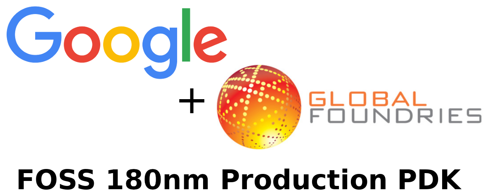

  

Welcome to the IEEE SSCS Chipathon 2025!  
This guide provides key information for participants. During the Chipathon, you will choose one track as shown below.

  

We encourage you to go througgh the following procedures:

1. General tool setup
2. Track-specific setup
    - MOSbius
    - Digital Building Blocks
    - Analog Automation

 

  

In 2025 Chipathon, an open-source GlobalFoundries 180nm (gf180) process design kit (PDK) will be used. You can check the following links for more info:

- [Github Repository](https://github.com/google/gf180mcu-pdk)
- [Documentation](https://gf180mcu-pdk.readthedocs.io/en/latest/)
- [YouTube Videos](https://www.youtube.com/playlist?list=PLZuGFJzpFksCU7yKn2P_xRTOktVBDWAJf)

  

# 1. General Tool Setup

The following guidelines help you set up the tools using the [IIC-OSIC-TOOLS](https://github.com/iic-jku/iic-osic-tools) Docker image by Harald Pretl's team.

Choose one of the following links to setup the tools, which best fits your environment. Experienced users may configure the tools using their own preferred method.

**MOSbius** and **Analog Automation** tracks use slight variations of the general tool setup. Once you are familiar with the general tool setup, adapting to each track is straightforward.

- **[Windows/MacOS only]**  
👉 Kwantae Kim's [Blog Post](https://kwantaekim.github.io/2024/05/25/OSE-Docker/)  
🌱 Beginner-friendly
- **[Any OS]**  
👉 Saptarshi Ghosh's [Google Doc](https://docs.google.com/document/d/13r-pB7vhYnCb-n46CAAlqXrKSj99bQtmEeyoayEV3Ak/edit?tab=t.0)

  

# 2. Track-Specific Setup

## 2.1. MOSbius

- [`resources/MOSbius`](https://github.com/KwantaeKim/sscs-chipathon-2025/tree/main/resources/MOSbius): Github directory for general info. It redirects to `mosbiuschip` repository (below).
- [mosbiuschip](https://github.com/KwantaeKim/sscs-chipathon-2025/tree/main/resources/Analog_Automation_gLayout): Github directory for general info and resources of `mosbius` track. The `mosbius`-specific setup guide can be also found.

## 2.2. Digital Building Blocks

> 🚧 **Under Construction** 

## 2.3. Analog Automation

You will extensively use the Python-powered analog automation tool, called `Glayout`.

- [`resources/AnalogAutomation_gLayout`](https://github.com/KwantaeKim/sscs-chipathon-2025/tree/main/resources/Analog_Automation_gLayout): Github directory for general info and resources.
- [Google Doc (Glayout)](https://docs.google.com/document/d/13r-pB7vhYnCb-n46CAAlqXrKSj99bQtmEeyoayEV3Ak/edit?tab=t.dy4a5w3lme18): `Glayout`-specific setup guide
- [Google Doc (Klive)](https://docs.google.com/document/d/13r-pB7vhYnCb-n46CAAlqXrKSj99bQtmEeyoayEV3Ak/edit?tab=t.gc3heib3ge74): Setup guide required to run `Glayout` interactively
